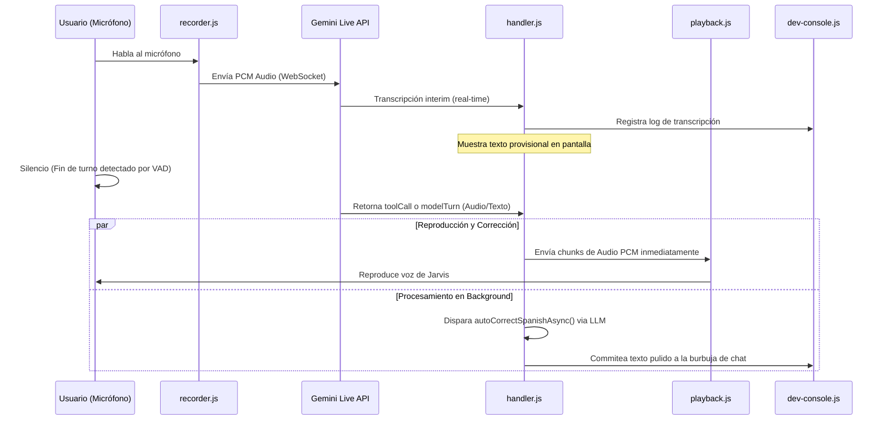

# Arquitectura de JARVIS MK.II

Este documento describe la estructura organizativa, responsabilidades y flujo de datos del proyecto JARVIS para facilitar el desarrollo, personalización y mantenimiento del sistema por parte de humanos y asistentes de IA.

---

## 🗺️ Mapa de Directorios (js/)

La lógica de JARVIS se divide en módulos especializados dentro de `js/`:

```
js/
├── Core/Connection/      # Conexión WebSocket con Gemini Multimodal Live API
│   ├── manager.js        # Ciclo de vida de la conexión y reconexión activa
│   └── handler.js        # Receptor y parser de eventos WS (audio, toolCalls, texto)
│
├── audio/                # Procesamiento de hardware y flujos de audio
│   ├── playback.js       # Reproducción de PCM audio chunks recibidos del modelo
│   ├── recorder.js       # Captura de micrófono, cancelación de eco y envío de PCM
│   └── visualizer.js     # Renderizador de la onda de voz en canvas
│
├── chat/                 # Interfaz gráfica de chat e interacción
│   ├── messages.js       # Creación de burbujas, textos interim y definitivos
│   ├── text-processor.js # Parsing de bloques de código y remoción de etiquetas
│   └── diagnostics.js    # Panel de métricas internas y diagnósticos en UI
│
├── config/               # Configuración del sistema y preferencias locales
│   ├── jarvis.config.js  # CONFIGURACIÓN CENTRAL (timeouts, modelos, VAD)
│   ├── index.js          # Persistencia en localStorage y sincronización con disco
│   └── system-instruction.js # Generación dinámica de la instrucción del sistema
│
├── documents/            # Gestión de documentos generados
│   └── artifacts.js      # Panel lateral de artefactos y descargas de código/markdown
│
├── engines/              # Motores secundarios e integraciones externas
│   ├── index.js          # Bootstrapping de JOS (Jarvis Operating System)
│   ├── provider-chat.js  # Fallback a proveedores locales (Ollama/Llama)
│   └── integration/      # Conectores externos (n8n, Spotify, Google, Slack, etc.)
│
├── kernel/               # Núcleo de observabilidad y métricas del sistema
│   ├── index.js          # Loop de control principal y arranque coordinado
│   ├── logger.js         # Sink centralizado de logs (consola, buffer, IPC)
│   └── metrics.js        # Recolección de tiempos, latencias y llamadas
│
├── memory/               # Gestión de contexto persistente
│   └── memory-manager.js # Memoria semántica local indexada para Gemini
│
├── system/               # Control del sistema operativo Windows y guardianes
│   ├── connection-guardian.js # Watchdog de reconexión y restauración de audio
│   ├── apps.js           # Escaneo y lanzamiento de aplicaciones instaladas
│   ├── controls.js       # Ajustes de volumen, brillo y comandos PowerShell
│   └── supervisor.js     # Reportes de auditoría interna de ejecución del agente
│
├── tools/                # Registro y ejecución de capacidades (Tools)
│   ├── registry.js       # Declaración de firmas de herramientas para Gemini
│   ├── executor.js       # Despachador de llamadas a ejecutores locales
│   └── handlers/         # Manejadores de herramientas (research, media, system, etc.)
│
├── ui/                   # Paneles informativos y widgets flotantes
│   ├── dev-console.js    # Consola en tiempo real de logs flotante (Ctrl+`)
│   ├── info-panel.js     # Vista detallada de investigaciones y multimedia
│   └── task-bubble.js    # Indicadores visuales de tareas en ejecución
│
└── utils/                # Utilidades comunes y algoritmos transversales
    ├── autocorrect.js    # Corrección de transcripción (Regex + Gemini Polish)
    ├── event-bus.js      # Bus de eventos desacoplado para comunicación interna
    └── logger.js         # Wrapper para vincular módulos al logger central
```

---

## ⚡ Flujo de Datos Principal



---

## ⚙️ Configuración y Personalización

El archivo centralizado **[jarvis.config.js](file:///C:/Users/Admin/Documents/Jarvis/js/config/jarvis.config.js)** es el único punto de control para afinar el comportamiento de JARVIS:

- **AI Model**: Cambiar el modelo de Gemini Live o el modelo de corrección/traducción.
- **VAD Sensitivity**: Ajustar los milisegundos de silencio para acortar o alargar el tiempo de respuesta.
- **Logger Limits**: Configurar el tamaño del buffer y el rate limiting de los registros.
- **Traducciones**: Modificar el timeout y comportamiento de la traducción del panel de investigación.
